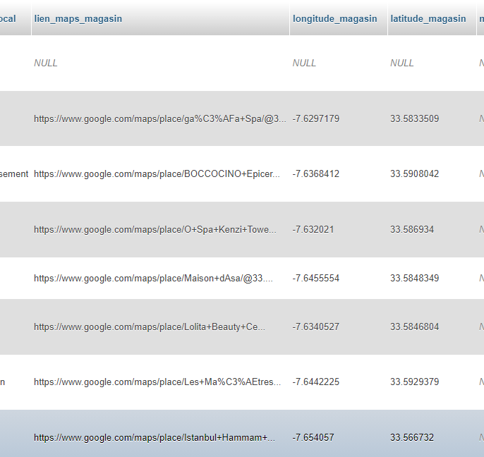

# mapsToCoord

Gets `Google.maps` link and changes it into coordinates that can be used into a map.
 
## Technology used

I coded this program using [`NodeJs`](https://github.com/nodejs/node) and [`GoogleApi`](https://github.com/googleapis/google-api-nodejs-client). I also used `MySQL` to store the database I used that has all the `GoogleMaps` links.

## How to run 

To get started you can `git clone  https://github.com/DYasser/mapsToCoord.git` and have `NodeJs` installed and initialized. 

Run `npm start` to run the server, and have `MySQL` already open and running. Go to `localhost:3000/test` to start the program, it will automatically do its duty then.

## Coding process

I first started by importing all the essential libraries such as `express`, `cors`, `body-parser`, etc. I then established a connection with the database I will be using using the `myqsl` library.

I then test the connection to see if everything is working correctly.

```javascript
//Testing the connection to the server, you can delete this when you push to a server since it is useless to console it there.
connection.query('SELECT 1', (err, result) => {
    console.log({ error: err, ok: result })
    if (err) {
        next(err)
    }
})
```

I then use `cors` to remove all cors errors that can be due for using different sources than the original one used which is `localhost:3000` in my case.

```javascript
//Calling route folders using CORS DO NOT REMOVE CORS.
app.use("/api", cors(), Router);
```

In the code above I set up a route and use `cors` in it to avoid all the errors.

In the route file, I set up a route to `/test` that would be added into the `localhost:3000` and that will run the code I will put inside of the controller and model file.

```javascript
const express = require("express"),
    coords = require("../controllers/coords.controller"),
    router = express.Router();
    
//Cheking if api is working route
router.get("/", (req, res) => {
    res.json(require('../../version.json') );
})

router.get("/test", coords.urlToCoord);

module.exports = router;
```

In the controller file we will take tall the information we have from the database using the model file that has the query code to retrieve the information needed.

```javascript
urlToCoord: (req, res) => {
        connection.query(coords_model.get_urls, (err, result) => {
            result.forEach( data => {
                if(!err){
                    const id = data.id_article;
                    const latlng = data.lien_maps_magasin.match(/@(-?\d+\.\d+),(-?\d+\.\d+)/g);
                    const lattitude = String(String(latlng).match(/@(-?\d+\.\d+)/g)).substring(1);
                    const longitude = String(String(latlng).match(/,(-?\d+\.\d+)/g)).substring(1);
                    if(lattitude!='ull'){
                        connection.query(coords_model.upd_coord, [
                            longitude,
                            lattitude,
                            id
                        ], (error, result) => {
                            if(error){
                                console.log(error);
                            }
                        })
                    }
                }
                else {
                    console.log(result);
                }
            });
        })    
        return res.status(200).json();
    }
```

Above is the controller file that gets the article id from the query and gets the `GoogleMaps` link that gets used to retrieve the exact coordinates using the `GoogleApi`.
Below is the Query code executed to get the data needed.

```javascript
const get_urls = `
SELECT lien_maps_magasin, id_article
FROM tab_annonces
WHERE lien_maps_magasin IS NOT NULL 
`

const upd_coord = `
UPDATE tab_annonces
SET 
    code_statut_article =    'MODI' ,
    longitude_magasin   =       ?   ,
    latitude_magasin    =       ?      
WHERE 
    lien_maps_magasin IS NOT NULL 
AND id_article  =    ?
`
```

So, after retrieving the exact data needed the program gives coordinates and inputs them inside the database as we can see in the image below.



>     This is the end of my documentation.
